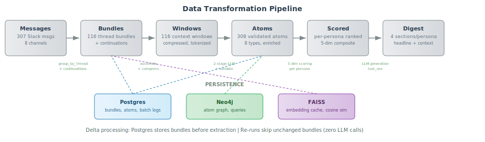
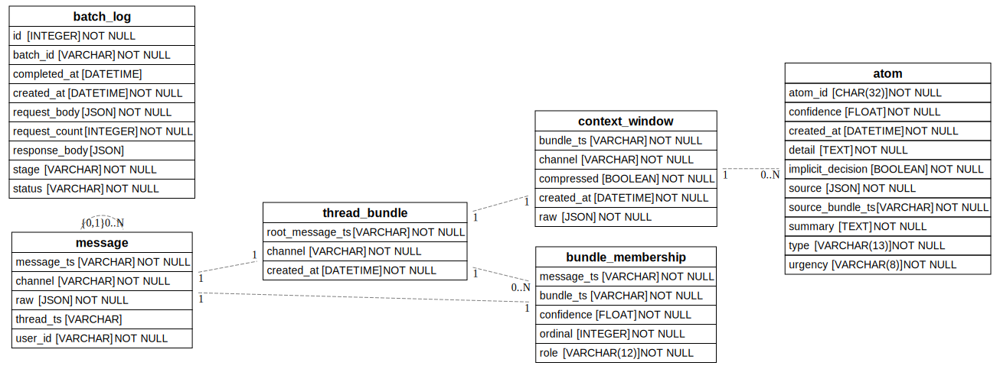
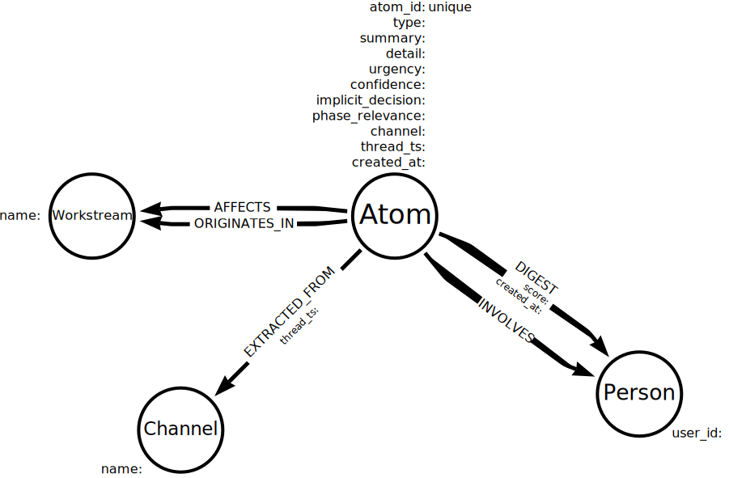
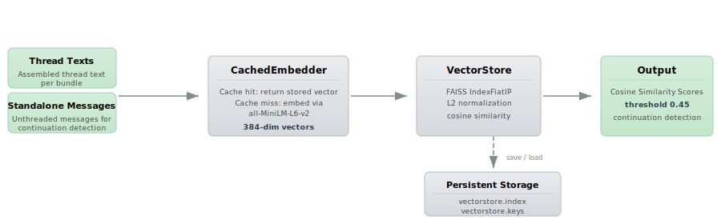
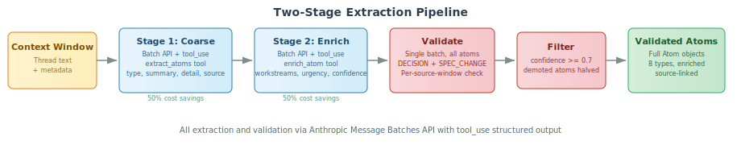
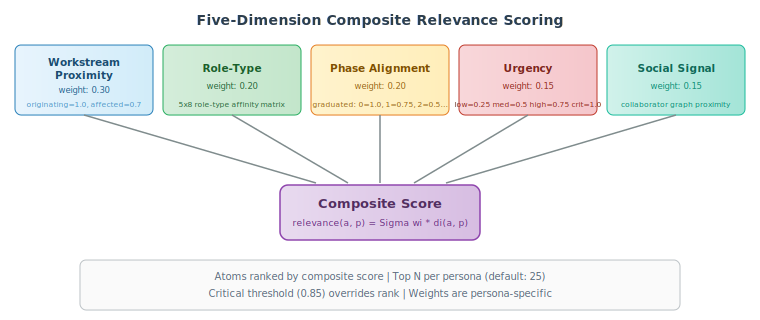
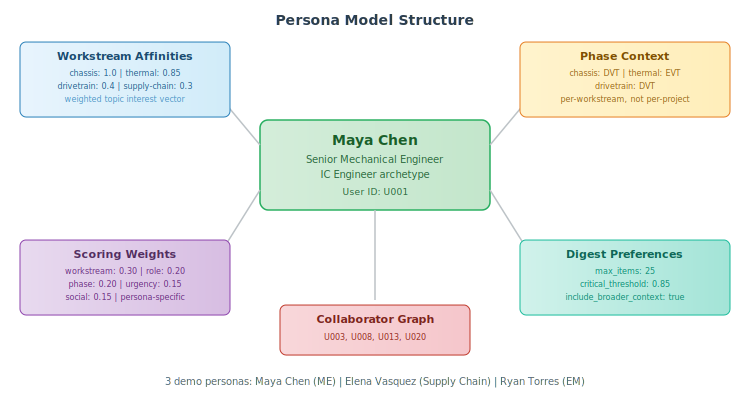

.. _design-document:

=====================================================================
Technical Design Document
=====================================================================

---------------------------------------------------------------------------
1. Problem Statement
---------------------------------------------------------------------------

1.1 The Core Problem
~~~~~~~~~~~~~~~~~~~~

In hardware engineering, the cost of missed information is measured in weeks,
dollars, and physical waste. A mechanical engineer who misses a tolerance
change on a bracket discovers it when 500 injection-molded parts arrive wrong.
A supply chain lead who misses a component discontinuation notice learns about
it when the production line stops.

The failure mode I am designing against: **someone changed a spec,
made a decision, or raised a risk in a Slack thread that the affected party
was not watching, and the downstream impact was not caught for days or weeks.**

This is not a summary tool. It is an information insurance policy for teams
where mistakes are physical and often irreversible.

1.2 Why Existing Solutions Fail
~~~~~~~~~~~~~~~~~~~~~~~~~~~~~~~

Slack's built-in features are pull-based. They require the user to know what
to look for. Generic AI summarization tools treat all readers as identical.
But a summary of #chassis-design that's useful for the mechanical engineer is
noise for the supply chain lead, who only needs the material change buried in
message 47 of a weight-reduction thread. **Relevance is not a property of a
message; it is a relationship between a message and a reader.**

---------------------------------------------------------------------------
2. Operating Assumptions
---------------------------------------------------------------------------

.. list-table::
   :header-rows: 1
   :widths: 8 40 40 12

   * - ID
     - Assumption
     - Architectural Impact
     - Load
   * - A1
     - Cloud LLM access is available (Anthropic API).
     - Pipeline design, cost model, latency.
     - **High**
   * - A2
     - Team size is 20 to 30 people, 300 to 500 messages/day across 8 to
       15 channels. Nightly batch territory, not streaming.
     - Ingestion architecture, processing budget.
     - **High**
   * - A3
     - Threads are used inconsistently. Some conversations are in-thread,
       others as top-level messages referencing earlier context implicitly.
     - Thread reconstruction logic, context windowing.
     - Medium
   * - A4
     - People wear multiple hats. Relevance must be modeled as weighted topic
       interests per user, not rigid role buckets.
     - Persona model, relevance scoring.
     - **High**
   * - A5
     - Different subsystems are in different phases simultaneously
       (Concept, Engineering Validation Test (EVT), Design Validation
       Test (DVT), Production Validation Test (PVT), Mass Production
       (MP)). Phase is a property of a workstream,
       not the project.
     - Phase representation, scoring.
     - **High**
   * - A6
     - No Product Lifecycle Management (PLM) / Enterprise Resource Planning (ERP) connectors for the prototype. Phase status is manually
       configured.
     - Context backbone population.
     - Medium
   * - A7
     - The digest is a read-only artifact. The prototype processes all
       available messages; production would filter to the previous 24 hours.
     - Digest rendering, temporal scope, feedback availability.
     - Low
   * - A8
     - Slack channels are organized primarily by workstream
       (``#chassis-design``, ``#supply-chain``, etc.) with cross-cutting
       channels (``#amr-general``, ``#testing``).
     - Channel-to-workstream mapping.
     - Medium
   * - A9
     - All communication is in English. Continuation detection regex
       patterns ("re:", "following up on"), LLM prompts, and atom type
       taxonomy are English-only.
     - Multilingual support requires prompt localization and regex
       rewrite.
     - Medium
   * - A10
     - Actionable information is in message text. Files, images, link
       previews, and Slack rich formatting are not processed. Message
       edits and deletions are not tracked.
     - Ingestion scope. PLM/CAD connector would address the file gap.
     - Medium
   * - A11
     - Validation targets only the two highest-risk atom types
       (``DECISION``, ``SPEC_CHANGE``). Other types (``ACTION_ITEM``,
       ``BLOCKER``, ``RISK``, ``TEST_RESULT``, ``STATUS_UPDATE``,
       ``QUESTION``) pass through with extraction confidence only.
     - Validation cost model, hallucination risk for non-validated types.
     - Medium
   * - A12
     - Phase progression is linear (Concept to EVT to DVT to PVT to MP)
       with graduated distance scoring. Non-linear progressions (phase
       rollbacks, parallel tracks) are not modeled.
     - Phase alignment scoring dimension.
     - Medium
   * - A13
     - All timestamps are UTC. No timezone configuration or localization.
     - Digest generation timestamps, scheduled pipeline timing.
     - Low
   * - A14
     - Neo4j failures are non-critical (soft failure with warning log).
       Postgres failures are critical (pipeline aborts). FAISS embedding
       cache persists to disk across runs.
     - Persistence layer fault tolerance hierarchy.
     - Medium

---------------------------------------------------------------------------
3. System Architecture
---------------------------------------------------------------------------

The system is an async pipeline that transforms raw Slack messages into
persona-specific daily digests. It consists of five layers with defined
responsibility and interface contracts.

.. image:: _static/architecture.svg
   :alt: Daily Digest Tool five-layer pipeline architecture
   :width: 100%

3.1 Data Flow
~~~~~~~~~~~~~

The pipeline is triggered on demand via ``POST /pipeline/run`` (production:
scheduled daily at 06:00 local time).

**Layer 1, Ingest.** Messages are loaded, grouped into thread bundles, and
checked for semantic continuations using FAISS cosine similarity (threshold
0.45). Each bundle is assembled into a context window: short threads are
included in full; long threads are compressed to the root message, top-reacted
replies, and final 5 messages.

**Layer 2, Extract.** Each context window passes through a two-stage
Anthropic Batch API pipeline (see Section 4). Stage 1 extracts coarse atoms;
Stage 2 enriches with metadata. Both use ``tool_use`` for structured output.

**Layer 3, Validate & Filter.** All ``DECISION`` and ``SPEC_CHANGE`` atoms
are validated in a single batch against their source context. Invalid atoms
have confidence halved. A confidence filter (threshold of 0.7 or above)
removes low-quality atoms.

**Layer 4, Score.** Each validated atom is scored for each persona across
five relevance dimensions (see Section 5). Atoms are ranked by composite
score, capped at the persona's ``max_items``.

**Layer 5, Generate.** Scored atoms and persona context are passed to the
LLM, which generates a four-section digest via ``tool_use`` structured output.

3.2 Persistence
~~~~~~~~~~~~~~~

3.2.1 Postgres
^^^^^^^^^^^^^^

Bryce Codd Normal Form (BCNF) schema with 6 tables linked by foreign keys. SQLAlchemy async
ORM with asyncpg driver. All tables and columns have SQL COMMENTs
for self-documenting schema inspection.

- **message** — raw Slack messages with JSONB payload
- **thread_bundle** — thread groupings by root message
- **bundle_membership** — message-to-bundle mapping with role and confidence
- **context_window** — assembled LLM input text (1:1 with bundle)
- **atom** — extracted information atoms with provenance JSONB
- **batch_log** — full LLM request/response JSONB audit trail

3.2.2 Neo4j
^^^^^^^^^^^^

**Node properties:**

.. list-table::
   :header-rows: 1
   :widths: 25 75

   * - Node
     - Properties
   * - ``:Atom``
     - atom_id, type, summary, detail, urgency, confidence,
       implicit_decision, phase_relevance, channel, thread_ts, created_at
   * - ``:Channel``
     - name
   * - ``:Workstream``
     - name
   * - ``:Person``
     - user_id, handle
   * - ``:DigestRun``
     - person_id, run_date, sections_json, generated_at

**Relationship properties:**

.. list-table::
   :header-rows: 1
   :widths: 30 70

   * - Relationship
     - Properties
   * - ``:EXTRACTED_FROM``
     - thread_ts
   * - ``:ORIGINATES_IN``
     - (none)
   * - ``:AFFECTS``
     - (none)
   * - ``:INVOLVES``
     - (none)
   * - ``:HAS_DIGEST``
     - (none)
   * - ``:INCLUDES``
     - score

The digest model follows the path
``:Person`` -[``:HAS_DIGEST``]-> ``:DigestRun`` -[``:INCLUDES`` {score}]-> ``:Atom``.
``:DigestRun`` stores the rendered sections JSON so historical digests
are served instantly from Neo4j without LLM calls on restart.

3.2.3 FAISS
^^^^^^^^^^^^^

IndexFlatIP with L2-normalized vectors for cosine similarity.
``CachedEmbedder`` wraps sentence-transformers (all-MiniLM-L6-v2)
with a persistent Fcebook AI Similarity Search (FAISS) cache. Two sources are embedded: thread texts
(for bundle representation) and standalone messages (for continuation
detection). The cache persists to ``data/vectorstore.index`` +
``data/vectorstore.keys`` across pipeline runs.

3.3 Delta Processing
~~~~~~~~~~~~~~~~~~~~

Bundles are persisted to Postgres *before* extraction. On re-run, the pipeline
queries for existing bundles and only extracts new or changed ones. This means
zero LLM calls on unchanged data, which is the single most important property
for cost control during development and idempotent production runs.

3.4 Tech Stack
~~~~~~~~~~~~~~

.. list-table::
   :header-rows: 1
   :widths: 20 30 50

   * - Layer
     - Technology
     - Rationale
   * - Frontend
     - React + TypeScript + Tailwind CSS
     - Persona switcher, sectioned digest, phase toggle.
   * - Backend
     - Python (FastAPI), Pydantic v2
     - Best LLM library ecosystem, strong typing.
   * - LLM
     - Anthropic (``claude-haiku-4-5``), Message Batches API, ``tool_use``
     - Structured output without dependencies. 50% batch savings.
   * - Persistence
     - Postgres + Neo4j + FAISS
     - Delta processing, graph queries, embedding cache.
   * - Config
     - YAML (``config/pipeline.yml``, ``prompts.yml``, ``personas.yml``,
       ``scoring.yml``, ``phases.yml``)
     - All prompts and constants externalized.
   * - Docs
     - Sphinx (reStructuredText)
     - Professional documentation site.

---------------------------------------------------------------------------
4. Extraction Pipeline (Layer 2)
---------------------------------------------------------------------------

4.1 Thread Reconstruction
~~~~~~~~~~~~~~~~~~~~~~~~~

Thread reconstruction operates in three passes:

**Pass 1, Structural grouping.** Group messages by Slack ``thread_ts``.

**Pass 2, Implicit threading.** Identify top-level messages that continue
earlier conversations using a hybrid approach: structural matching
(@-mentions, quote blocks, back-references) as a fast path, and semantic
embedding cosine similarity (threshold 0.45) as a fallback. Channel-aware,
first-match.

**Pass 3, Context windowing.** Assemble each conversational unit into a
context window within LLM token limits. Long threads are compressed to the
opener, most-reacted messages, and final 5 messages.

4.2 Information Atom Types
~~~~~~~~~~~~~~~~~~~~~~~~~~

.. list-table::
   :header-rows: 1
   :widths: 18 42 40

   * - Atom Type
     - Definition
     - Example
   * - ``DECISION``
     - A choice constraining future work: material selections, design
       approaches, vendor choices.
     - "Team agreed to switch housing from aluminum to magnesium."
   * - ``SPEC_CHANGE``
     - A modification to an established spec, tolerance, or requirement.
       Highest-risk type because it silently invalidates downstream work.
     - "Motor torque updated from 2.5 Nm to 3.1 Nm."
   * - ``ACTION_ITEM``
     - A task assigned to a specific person with an implied deadline.
     - "Sarah will send updated STEP files by Friday."
   * - ``BLOCKER``
     - An impediment preventing progress on a workstream.
     - "Can't proceed with enclosure until thermal provides heat specs."
   * - ``RISK``
     - A concern that could affect schedule, cost, or performance.
     - "Vendor says FPGA lead time may extend to 16 weeks."
   * - ``TEST_RESULT``
     - Outcome of a test or validation activity.
     - "Vibration test on chassis rev C passed all axes."
   * - ``STATUS_UPDATE``
     - Progress report on a workstream or task.
     - "PCB layout is 80% complete, sending to fab Tuesday."
   * - ``QUESTION``
     - An unanswered question requiring input from outside the conversation.
     - "Does IP67 sealing apply to the debug connector?"

4.3 Two-Stage Extraction
~~~~~~~~~~~~~~~~~~~~~~~~~

Extraction uses two stages to reduce cognitive load per LLM call:

**Stage 1 (Coarse):** Identifies events and returns lightweight atom dicts:
``type``, ``summary``, ``detail``, ``source``. Uses the ``extract_atoms``
tool via Anthropic Batch API.

**Stage 2 (Enrichment):** For each coarse atom, assigns metadata:
``workstreams``, ``urgency``, ``confidence``, ``implicit_decision``,
``phase_relevance``. Uses the ``enrich_atom`` tool. Both the coarse atom
and original thread context are provided.

Both stages use ``tool_use`` for Pydantic-validated structured output, with
the Anthropic Message Batches API for 50% cost savings.

4.4 Prompt Design Principles
~~~~~~~~~~~~~~~~~~~~~~~~~~~~~

**Extract conclusions, not discussions.** A 30-message debate should produce a
single ``DECISION`` atom, not a summary of the debate.

**Flag implicit decisions.** When someone casually says "let's just go with
magnesium" and the conversation moves on, that is an implicit decision with
procurement, tooling, and certification consequences. The LLM surfaces these
with a confidence field.

**Identify cross-workstream impacts.** Each atom tags the originating
workstream *and* affected workstreams. A material change in mechanical affects
supply chain. These cross-tags enable surfacing information to people who
weren't in the original conversation.

4.5 Validation and Hallucination Mitigation
~~~~~~~~~~~~~~~~~~~~~~~~~~~~~~~~~~~~~~~~~~~~

In hardware engineering, a hallucinated tolerance value is actively dangerous.
Three safeguards:

**Confidence scoring.** Atoms below threshold (0.7) are excluded.

**Source anchoring.** Every atom links to its Slack thread and message range.
The reader can always verify.

**Extraction validation.** ``SPEC_CHANGE`` and ``DECISION`` atoms undergo a
second LLM pass comparing the extracted atom against its source context.
Failed atoms are demoted (confidence halved, warning appended). All
validation requests across all threads are collected into a single batch.

---------------------------------------------------------------------------
5. Relevance Scoring (Layer 4)
---------------------------------------------------------------------------

5.1 Relevance Is Relational
~~~~~~~~~~~~~~~~~~~~~~~~~~~~~

A message is not inherently important. It is important *to someone* in
*some context*. The same ``SPEC_CHANGE``, "motor torque increased from
2.5 Nm to 3.1 Nm," is critical for the power systems engineer, important
for supply chain, contextual for the PM, and irrelevant for the enclosure ME.

5.2 Scoring Dimensions
~~~~~~~~~~~~~~~~~~~~~~~

Each atom is scored per persona across five dimensions:

**Workstream Proximity (0.30).** Does this atom originate from or affect a
workstream the persona tracks? Each persona has a weighted affinity vector.
Originating workstream scores 1.0; affected workstreams score 0.7;
affinities scale from there.

**Role-Type Alignment (0.20).** Does this atom type typically matter to this
role archetype? Encoded as a 5x8 role-type affinity matrix:

.. code-block:: text

   Role            DECISION  SPEC_CHG  ACTION  BLOCKER  RISK  TEST  STATUS  QUESTION
   IC Engineer       0.8      1.0       0.7     0.6     0.5   1.0    0.3     0.6
   Eng Manager       1.0      0.7       0.8     1.0     0.9   0.6    0.9     0.5
   Supply Chain      0.7      0.9       0.8     0.7     1.0   0.3    0.5     0.4

**Phase Alignment (0.20).** Graduated distance scoring across the linear
phase order (Concept=0, EVT=1, DVT=2, PVT=3, MP=4). Exact match scores 1.0,
adjacent scores 0.75, decreasing with distance. Because different workstreams
occupy different phases (assumption A5), lookup is per-workstream.

**Urgency (0.15).** Atom urgency (low=0.25, medium=0.5, high=0.75,
critical=1.0). Boosts relevance but does not override it. An urgent
firmware atom is still irrelevant to a mechanical engineer.

**Social Signal (0.15).** Was this atom from a conversation involving the
persona's close collaborators? Proxy for the informal trust network.

5.3 Composite Score
~~~~~~~~~~~~~~~~~~~

.. code-block:: text

   relevance(a, p) = w₁·workstream(a,p) + w₂·role_type(a,p)
                    + w₃·phase(a,p) + w₄·urgency(a) + w₅·social(a,p)

   where Σwᵢ = 1.0 and wᵢ are persona-specific.

Atoms are ranked by composite score. The top *N* (default: 25) form the
digest. Atoms above 0.85 are placed in "Requires Your Action" regardless
of rank position.

---------------------------------------------------------------------------
6. Persona Model (Layer 3)
---------------------------------------------------------------------------

A persona models what a specific person cares about. Richer than a role
label, more stable than a per-query signal.

.. code-block:: json

   {
     "user_id": "U001",
     "name": "Maya Chen",
     "role_archetype": "IC Engineer",
     "title": "Senior Mechanical Engineer",
     "workstream_affinities": {
       "chassis": 1.0, "thermal": 0.85, "drivetrain": 0.4,
       "supply-chain": 0.3, "power-systems": 0.2
     },
     "phase_context": {"chassis": "DVT", "thermal": "EVT"},
     "scoring_weights": {
       "workstream_proximity": 0.30, "role_type_alignment": 0.20,
       "phase_alignment": 0.20, "urgency": 0.15, "social_signal": 0.15
     },
     "collaborator_graph": ["U003", "U008", "U013", "U020"],
     "digest_preferences": {
       "max_items": 25, "critical_threshold": 0.85,
       "include_broader_context": true
     }
   }

The phase vector is a first-class entity: a robotics program might have
chassis in DVT, thermal in late EVT, sensors in EVT, and end-effector in
Concept, all simultaneously. Phase alignment scoring queries each
workstream independently.

For the prototype, three personas are manually defined. Production
initialization would draw from Slack metadata (channel membership, message
frequency), organizational data (title, team), and self-declaration.

---------------------------------------------------------------------------
7. Digest Generation (Layer 5)
---------------------------------------------------------------------------

7.1 Digest Structure
~~~~~~~~~~~~~~~~~~~~

Four priority-tiered sections, consistent structure across personas but
different *contents* based on relevance scoring:

**Section 1, Requires Your Action.** Atoms above the critical threshold
involving an explicit or inferred action. Intentionally short (0 to 5 items).

**Section 2, Decisions & Changes.** ``DECISION`` and ``SPEC_CHANGE`` atoms
from relevant workstreams. This catches the "material change you didn't know
about" failure mode.

**Section 3, Progress & Risks.** ``STATUS_UPDATE``, ``TEST_RESULT``,
``BLOCKER``, and ``RISK`` atoms ordered by relevance.

**Section 4, Broader Context.** Lower-relevance atoms for general team
awareness. Optional (controlled by persona preference), capped at 5 items.

7.2 Generation Prompt
~~~~~~~~~~~~~~~~~~~~~

The LLM receives the persona definition, scored atoms in priority order, and
a system prompt defining structure, tone, and formatting.

**Tone: Briefing, not newsletter.** Terse, specific, actionable. Hardware
engineers want information density, not narrative flair.

**Format: Scannable.** Each item gets a bold headline, 1 to 2 sentence
context, and a source link. 30-second scan of headlines, then drill into
details.

**Judgment: Do not editorialize.** Report what happened and who is affected.
No opinions, no recommendations. Trust is lost the moment the digest adds
unsolicited commentary.

---------------------------------------------------------------------------
8. Deployment and Cost
---------------------------------------------------------------------------

8.1 Scaling Characteristics
~~~~~~~~~~~~~~~~~~~~~~~~~~~

.. list-table::
   :header-rows: 1
   :widths: 15 35 35 15

   * - Tier
     - Profile
     - Architecture
     - Prototype?
   * - Small
     - 10 to 30 people, 200 to 500 msgs/day
     - On-demand or nightly batch. Postgres + Neo4j + FAISS.
       Anthropic Batch API (one key). Docker Compose. Delta processing.
     - **Yes**
   * - Medium
     - 50 to 100 people, 1K to 3K msgs/day
     - Parallelized extraction. Redis cache.
     - No
   * - Large
     - 100 to 500 people, 5K to 20K msgs/day
     - Stream processor (Kafka). Searchable atom index. Self-hosted inference.
     - No

8.2 Cost Model (Small Tier)
~~~~~~~~~~~~~~~~~~~~~~~~~~~

.. code-block:: text

   Extraction pass:    ~150 units x ~2,000 tokens   = 300K input tokens
   Validation pass:    ~30 high-risk atoms x ~1,500  =  45K input tokens
   Generation pass:    ~25 personas x ~3,000 tokens  =  75K input tokens
   Output tokens:      ~150K across all passes
   ─────────────────────────────────────────────────────────────────
   Daily total:        ~420K input + ~150K output (with 50% batch discount)
   Estimated cost:     ~$3 to $8/day ($90 to $240/month)

The tool pays for itself if it prevents a single procurement error per
quarter.

8.3 On-Premises Path
~~~~~~~~~~~~~~~~~~~~

For teams where data sensitivity prohibits cloud LLM access (ITAR, trade
secrets), the ``AsyncLLMClient`` protocol supports self-hosted inference
via vLLM or TGI with open-weight models. Higher infra cost, lower extraction
quality, but all data stays within the network boundary.

---------------------------------------------------------------------------
9. Prototype Scope
---------------------------------------------------------------------------

9.1 What the Prototype Demonstrates
~~~~~~~~~~~~~~~~~~~~~~~~~~~~~~~~~~~~

A **proof of mechanism**: the same stream of Slack messages, processed
through a context-aware pipeline, produces meaningfully different digests
for different personas and project phases.

Includes: synthetic dataset (307 messages, 8 channels, plus an 18-message
demo dataset for fast live demos), working extraction pipeline, five-dimension
relevance scoring, three fully defined personas, and an interactive frontend
with persona switching and phase-transition toggles.

Persistence: Postgres (bundles, atoms, context windows, batch logs), Neo4j
(atom graph), and FAISS (embedding cache). Delta processing ensures re-runs
skip unchanged bundles.

9.2 What the Prototype Does Not Include
~~~~~~~~~~~~~~~~~~~~~~~~~~~~~~~~~~~~~~~~

Live Slack integration, user accounts/authentication, the adaptive feedback
loop (Section 5 describes the mechanism; prototype uses static weights),
PLM/ERP connectors, or production observability.

9.3 Synthetic Data Design
~~~~~~~~~~~~~~~~~~~~~~~~~~~

The synthetic dataset exhibits: realistic hardware communication patterns,
deliberate "buried signals" (cross-workstream impacts a naive summary would
miss), phase diversity (some workstreams in EVT, others in DVT), and thread
depth variety (2 to 3 messages up to 30 to 50 message arcs).

Buried signal examples:

1. A material change ("let's go with magnesium") buried in a weight-reduction
   thread that has procurement implications.
2. A test failure whose root cause implicates a different subsystem.
3. A vendor lead-time update affecting a workstream the supply chain lead
   doesn't directly follow.

---------------------------------------------------------------------------
10. Evaluation Criteria
---------------------------------------------------------------------------

**Differential relevance.** Different personas receive meaningfully different
digests. The ME's digest emphasizes chassis test results; the supply chain
lead's emphasizes material changes and vendor risks; the EM's emphasizes
blockers and cross-functional dependencies.

**Signal surfacing.** The digest surfaces "buried signals." The material
change should appear in the supply chain lead's digest even though it
originated in #chassis-design.

**Phase sensitivity.** The digest changes when a workstream transitions
between phases. EVT emphasizes design decisions; DVT emphasizes vendor
readiness and validation results.

Production metrics: time-to-awareness (target: same-day), missed-signal rate
(target: zero above critical threshold), engagement rate (target: 70%+),
false positive rate in "Requires Action" (target: below 15%).

---------------------------------------------------------------------------
11. Production Path
---------------------------------------------------------------------------

11.1 Multi-Provider LLM
~~~~~~~~~~~~~~~~~~~~~~~~

The ``AsyncLLMClient`` protocol supports additional adapters (OpenAI, Google,
self-hosted via vLLM). Re-add when a second provider is needed. The protocol
includes provider failover and model evaluation harness capabilities.

11.2 Stakeholder Questions
~~~~~~~~~~~~~~~~~~~~~~~~~~

These questions should be answered before production scoping:

**IP classification:** Can Slack content be processed by cloud LLM, or is
on-prem required? This is the highest-impact question.

**PM tool integration:** Does the team use Jira/Linear for phase tracking?
Automated phase detection eliminates manual toggles.

**Multi-source ingestion:** Do decisions also occur in email, Google Docs,
CAD comments, or PLM systems?

**User research:** Concrete "I missed X and it cost us Y" stories are the
best input for tuning extraction and scoring.

11.3 Live Slack Integration
~~~~~~~~~~~~~~~~~~~~~~~~~~~

Replace the fixture with real Slack API via OAuth bot token. Scopes:
``channels:history``, ``channels:read``, ``users:read``. Implement
incremental ingestion with high-water mark per channel. Handle message edits
and deletes. Live Slack integration also enables deep-linking digest items
back to their source messages. Each atom's ``source.channel`` and
``source.thread_ts`` become clickable Slack URLs rather than static
references.

11.4 Scheduled Pipeline
~~~~~~~~~~~~~~~~~~~~~~~

Replace the manual "Run Pipeline" button with daily scheduled execution
(cron or Slack webhook trigger). Pre-cook digests for all personas before
the workday starts.

11.5 Adaptive Feedback Loop
~~~~~~~~~~~~~~~~~~~~~~~~~~~~

Track implicit signals (dismissals, pins, click-throughs, dwell time) to
adjust per-user scoring weights over time. Exponential moving average with
slow learning rate (alpha = 0.05). Guardrails: weights cannot deviate more than
+/- 0.15 from defaults.

11.6 Multi-Team Support
~~~~~~~~~~~~~~~~~~~~~~~

Generalize from the 8-channel robotics team to arbitrary Slack workspaces.
Requires dynamic channel discovery, workstream inference, and persona
auto-detection from Slack metadata.

11.7 Evaluation Framework
~~~~~~~~~~~~~~~~~~~~~~~~~

Golden-set annotations with precision/recall metrics. Hallucination rate
tracking. Graded scoring beyond binary valid/invalid.

---------------------------------------------------------------------------
12. Complexity Analysis
---------------------------------------------------------------------------

12.1 Pipeline Stage Complexity
~~~~~~~~~~~~~~~~~~~~~~~~~~~~~~

Let M = messages, B = bundles, R = avg replies per bundle, S = standalone
messages, W = context windows, A = extracted atoms, V = validated atoms
(DECISION + SPEC_CHANGE), P = personas.

.. list-table::
   :header-rows: 1
   :widths: 25 30 15 30

   * - Stage
     - Time Complexity
     - LLM Calls
     - Notes
   * - Load messages
     - O(M)
     - 0
     - JSON fixture or API
   * - Group by thread
     - O(M log R + B log B)
     - 0
     - Dict grouping + per-bundle sort
   * - Detect continuations
     - O(S x B)
     - 1 (embed)
     - Structural fast-path + semantic fallback
   * - Assemble windows
     - O(B x R log R)
     - 0
     - Compression sorts by reaction count
   * - Extraction (batch)
     - O(W + A)
     - ceil(W/100) + ceil(A/100)
     - Sub-batches of 100. 50% cost savings.
   * - Extraction (async)
     - O(W + A)
     - W + A
     - Per-window concurrent. Higher cost.
   * - Validation
     - O(V + A)
     - 1
     - Single batch for all DECISION/SPEC_CHANGE
   * - Confidence filter
     - O(A)
     - 0
     - Single-pass threshold check
   * - Scoring
     - O(P x A log A)
     - 0
     - Per-persona sort of all atoms
   * - Generation
     - O(P x max_items)
     - P
     - One LLM call per persona
   * - Postgres persist
     - O(B x R + A)
     - 0
     - Per-record merge (idempotent)
   * - Neo4j persist
     - O(A)
     - 0
     - Batch Cypher write

12.2 LLM Call Budget
~~~~~~~~~~~~~~~~~~~~

For the target scale (M = 300-500 messages, B ~ 150 bundles, A ~ 300 atoms,
P = 3 personas):

.. code-block:: text

   Batch mode (recommended):
     Embedding:     1 call
     Stage 1:       ceil(150/100) = 2 calls
     Stage 2:       ceil(300/100) = 3 calls
     Validation:    1 call
     Generation:    3 calls
     Total:         ~10 API calls

   Async mode (demo only):
     Embedding:     1 call
     Stage 1:       150 calls (1 per window)
     Stage 2:       300 calls (1 per atom)
     Validation:    1 call
     Generation:    3 calls
     Total:         ~455 API calls

Batch mode reduces API calls by ~45x and costs 50% less per call.

12.3 Memory Footprint
~~~~~~~~~~~~~~~~~~~~~

.. code-block:: text

   Messages in memory:     O(M x msg_size)     ~5-10 MB for M=500
   Embedding vectors:      O((B+S) x 384)      ~1-2 MB
   Context windows:        O(W x window_size)   ~2-5 MB
   Atoms (in-flight):      O(A x atom_size)     ~5-10 MB
   FAISS index:            O(cached x 1.5 KB)   ~1-5 MB
   Peak total:             ~20-40 MB

12.4 Bottlenecks
~~~~~~~~~~~~~~~~

**LLM API latency** dominates wall-clock time. Batch API scheduling adds
60-120s minimum overhead; async extraction completes in 30-90s for small
datasets but costs more.

**Scoring sort** is O(P x A log A) — the dominant CPU cost for large atom
counts. Could be optimized to O(P x A) with heap-based top-K selection.

**Postgres persistence** uses per-record merge for idempotency. Batch
insert would reduce round-trips for initial loads.

**FAISS rebuild** on duplicate key update is O(N x D) where N = cached
vectors and D = 384 dimensions. Mitigated by cache-hit checks before add.

---------------------------------------------------------------------------
13. Architecture Decision Records
---------------------------------------------------------------------------

**ADR-001: Batch over stream.** The target scale (300 to 500 msgs/day) does
not justify streaming infrastructure. Batch processing with a daily job
covers the use case. Truly urgent items use Slack's native notifications.
The digest is for *awareness*, not *alerting*.

**ADR-002: LLM extraction over rule-based NLP.** "Let's just go with
magnesium" is trivially identified as a material decision by an LLM but
nearly impossible to catch with rules. Higher per-message cost (around $0.01
to $0.03) but dramatically better recall for implicit decisions. The value
of one caught missed decision vastly exceeds the monthly API cost.

**ADR-003: Atom granularity.** One atom per discrete information unit, not
per message or thread. A 30-message thread might contain a test result, a
decision, and an action item. Different personas care about different atoms
from the same thread.

**ADR-004: Phase as vector, not scalar.** Phase is tracked per-workstream
because different subsystems routinely occupy different development phases.
A single project-level phase label produces incorrect relevance scoring for
multi-workstream personas.

**ADR-005: Two-pass validation for high-risk atoms.** ``SPEC_CHANGE`` and
``DECISION`` atoms undergo a second LLM pass checking for overstated
conclusions and fabricated details. Roughly 30% increase in extraction cost,
justified by the cost of hallucinated spec values in hardware.
