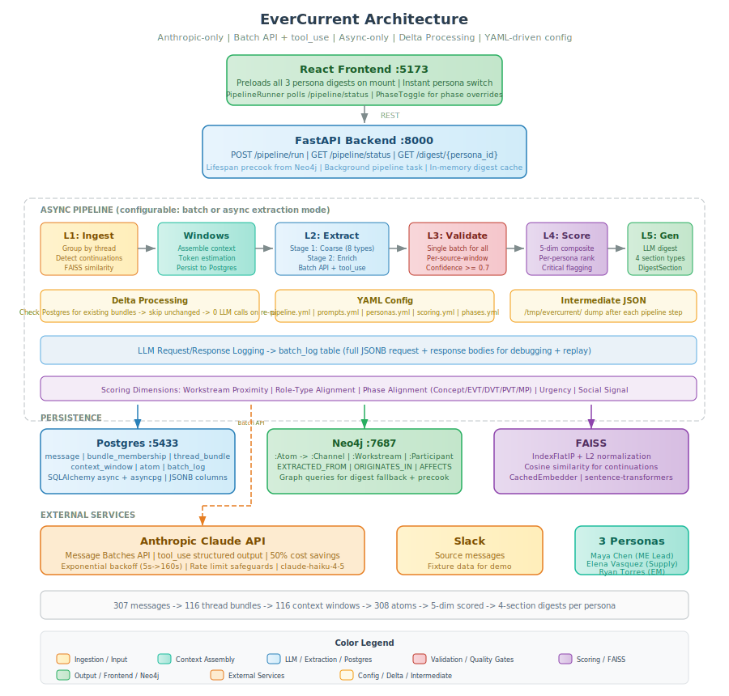

.. _design-document:

=====================================================================
EverCurrent Daily Digest Tool: Technical Design Document
=====================================================================

.. contents:: Table of Contents
   :depth: 3
   :local:

.. note::

   **Design Team**

   This document represents the combined thinking of a cross-functional
   architecture review. The following perspectives were represented:

   Systems Architecture (end-to-end data flow, service boundaries,
   failure modes, and deployment topology), ML/NLP Engineering
   (extraction pipeline design, LLM prompt architecture, relevance
   modeling, and evaluation methodology), Infrastructure Engineering
   (ingestion reliability, storage strategy, cost modeling, and scaling
   characteristics), Product Engineering (digest UX, feedback loops,
   persona modeling, and adoption mechanics), and Hardware Domain
   Engineering (failure mode elicitation, phase-gate semantics, and
   cross-discipline information flow patterns in robotics programs).

---------------------------------------------------------------------------
1. Problem Statement
---------------------------------------------------------------------------

1.1 The Surface Problem
~~~~~~~~~~~~~~~~~~~~~~~

A robotics hardware engineering team uses Slack for day-to-day communication.
Important updates get buried in threads. Different roles have different
priorities. The team needs a daily digest that surfaces the most relevant
information for each person.

1.2 The Actual Problem
~~~~~~~~~~~~~~~~~~~~~~

In hardware engineering, the cost of missed information is measured in weeks,
dollars, and physical waste. Not in minutes and keystrokes. A software
engineer who misses a Slack thread can push a fix in hours. A mechanical
engineer who misses a tolerance change on a bracket discovers it when 500
injection-molded parts arrive wrong. A supply chain lead who misses a
component discontinuation notice learns about it when the production line
stops.

The fundamental failure mode I am designing against is this: **someone
changed a spec, made a decision, or raised a risk in a Slack thread that the
affected party was not watching, and the downstream impact was not caught for
days or weeks.**

This is not a "nice-to-have summary tool." It is an information insurance
policy for teams where mistakes are physical and often irreversible.

1.3 Why Existing Solutions Fail
~~~~~~~~~~~~~~~~~~~~~~~~~~~~~~~

Slack's built-in features (channel notifications, saved items, search) are
pull-based. They require the user to know what to look for. The failure mode
I am designing against is precisely the case where the user *does not know*
they should be looking. They don't search for "magnesium housing" because they
still believe the housing is aluminum.

Generic Slack summarization tools (channel-level AI summaries, for example)
fail because they treat all readers as identical. A summary of #chassis-design
that's useful for the mechanical engineer is noise for the supply chain lead,
who only needs to know about the material change buried in message 47 of a
thread about weight reduction. Relevance is not a property of a message; it is
a relationship between a message and a reader.

---------------------------------------------------------------------------
2. Operating Assumptions and Constraints
---------------------------------------------------------------------------

The following assumptions define the operating envelope for this prototype.
Each assumption is tagged with its architectural impact so that corrections
can be traced to specific design decisions.

.. list-table::
   :header-rows: 1
   :widths: 8 40 40 12

   * - ID
     - Assumption
     - Architectural Impact
     - Load-Bearing
   * - A1
     - Cloud LLM access is available (Anthropic API). On-prem deployment
       with self-hosted models is addressed in section 8 as an alternative
       path.
     - Extraction and generation pipeline design, cost model, latency
       characteristics.
     - **High**
   * - A2
     - Team size is 20 to 30 people. Message volume is 300 to 500 messages
       per day across 8 to 15 channels. This is nightly batch job
       territory, not streaming infrastructure.
     - Ingestion architecture, processing budget, infrastructure cost.
     - **High**
   * - A3
     - Threads are used inconsistently. Some conversations happen in-thread,
       others as top-level channel messages that reference earlier context
       only implicitly. The ingestion layer must reconstruct conversational
       context regardless of threading discipline.
     - Thread reconstruction logic, context window management.
     - Medium
   * - A4
     - People wear multiple hats. A person with the title "Mechanical
       Engineer" may also be managing a vendor relationship and running the
       prototyping lab. Relevance must be modeled as weighted topic interests
       per user, not rigid role buckets.
     - Persona model, relevance scoring, feedback loop design.
     - **High**
   * - A5
     - The development process follows a loose phase-gate model (concept,
       EVT, DVT, PVT, MP), but different subsystems are in different
       phases at the same time. Phase is a property of a workstream, not a
       project.
     - Phase representation, relevance scoring, context backbone schema.
     - **High**
   * - A6
     - No PLM, ERP, or project management tool connectors for the prototype.
       Phase status is manually configured. The design document describes
       inference-based phase detection as a future capability.
     - Context backbone population, integration scope.
     - Medium
   * - A7
     - The digest is delivered as a read-only artifact each morning covering
       the previous 24 hours. Interactive features (mark as resolved, snooze,
       drill-down) are a natural next iteration, not prototype scope.
     - Digest rendering, feedback signal availability.
     - Low
   * - A8
     - Slack channel structure is organized primarily by workstream
       (``#chassis-design``, ``#power-systems``, ``#sensors``) with
       cross-cutting channels (``#amr-general``, ``#testing``,
       ``#supply-chain``). Channel membership is a weak but useful signal
       for topic interest.
     - Channel-to-workstream mapping, relevance seed signals.
     - Medium

---------------------------------------------------------------------------
3. System Architecture
---------------------------------------------------------------------------

3.1 Architecture Overview
~~~~~~~~~~~~~~~~~~~~~~~~~

The system consists of five layers. Each has a defined responsibility and
interface contract.

3.2 Data Flow
~~~~~~~~~~~~~

The daily digest pipeline executes in four phases, triggered by a scheduled
job at a configurable time (default: 06:00 local time).

**Phase 1, Harvest (Layer 1).** The ingestion layer queries the Slack API
(or reads from the event log) for all messages, thread replies, reactions,
and file-share events from the previous 24-hour window. Messages are grouped
into conversational units: a top-level message and all its thread replies
form a single unit. Top-level messages that are clearly continuations of
earlier conversations (detected via @-mentions, quote blocks, or explicit
references) are linked to their antecedents.

**Phase 2, Extract (Layer 2).** Each conversational unit is passed through
the extraction pipeline, which produces zero or more *information atoms*. An
atom is a structured record representing a single discrete piece of
information that someone on the team might need to know. The extraction LLM
is prompted to identify atoms of specific types (enumerated in section 4.2)
and to tag each atom with metadata including affected workstreams, involved
people, and urgency signals.

**Phase 3, Score (Layers 3 + 4).** For each persona, every atom is scored
across multiple relevance dimensions (enumerated in section 5.2). The
context backbone provides the world model needed for scoring: which
workstreams this person tracks, what phase each workstream is in, and what
types of information are phase-appropriate. Atoms are then clustered by
topic/workstream and sorted by composite relevance score within each cluster.

**Phase 4, Generate (Layer 5).** The top-scored atoms for each persona,
along with their cluster structure and the persona's context, are passed to
a generation LLM that produces the final digest. The digest is structured
into priority-tiered sections with natural-language summaries and
source-linked references back to the original Slack threads.

---------------------------------------------------------------------------
4. Extraction Pipeline (Layer 2)
---------------------------------------------------------------------------

4.1 Thread Reconstruction
~~~~~~~~~~~~~~~~~~~~~~~~~

Thread reconstruction is the first and most consequential step in the
extraction pipeline. The most important information in Slack is frequently
buried in threads: a thread that begins with "motor is overheating during
endurance test" and ends, 47 replies later, with "root cause identified:
thermal paste application was inconsistent, reworking 12 units" contains a
complete narrative arc that must be captured as a unit, not as 47 individual
messages.

The reconstruction algorithm operates in three passes:

**Pass 1, Structural grouping.** Group messages by their Slack thread
timestamp (``thread_ts``). This captures all explicitly threaded replies.

**Pass 2, Implicit threading.** Identify top-level messages that are
continuations of earlier conversations. Signals include: direct @-mentions
of someone who posted recently, quote-block references to earlier messages,
and semantic similarity above a threshold to recent thread conclusions.
These messages are linked to their antecedent threads as "continuation
units."

**Pass 3, Context windowing.** For each conversational unit, assemble a
context window that includes: the full thread (if under the token limit),
or a compressed version consisting of the thread opener, the most-reacted
messages, and the final 5 messages (which typically contain conclusions and
decisions). This compressed representation preserves the narrative arc while
fitting within LLM context limits.

4.2 Information Atom Types
~~~~~~~~~~~~~~~~~~~~~~~~~~

The extraction LLM is prompted to identify atoms of the following types.
This taxonomy was derived from analyzing common failure modes in hardware
engineering communication.

.. list-table::
   :header-rows: 1
   :widths: 20 45 35

   * - Atom Type
     - Definition
     - Example
   * - ``DECISION``
     - A choice that was made, explicitly or implicitly, that constrains
       future work. Includes material selections, design approaches, vendor
       choices, and test methodology decisions.
     - "Team agreed to switch housing material from aluminum to magnesium
       to meet weight target."
   * - ``SPEC_CHANGE``
     - A modification to a previously established specification, tolerance,
       interface definition, or requirement. This is the highest-risk atom
       type because it can silently invalidate downstream work.
     - "Updated motor torque requirement from 2.5 Nm to 3.1 Nm based on
       load testing results."
   * - ``ACTION_ITEM``
     - A task assigned to or claimed by a specific person, with an
       explicit or implied deadline.
     - "Sarah will send updated STEP files to the CNC vendor by Friday."
   * - ``BLOCKER``
     - An impediment that is preventing progress on a workstream. Blockers
       have an owner (the person blocked) and often an implicit dependency
       (the person or resource that could unblock them).
     - "Can't proceed with battery enclosure design until thermal team
       provides updated heat dissipation requirements."
   * - ``RISK``
     - An identified risk or concern that has not yet materialized into a
       blocker but could affect schedule, cost, or performance.
     - "Vendor says lead time on the motor controller FPGA may extend to
       16 weeks due to allocation issues."
   * - ``TEST_RESULT``
     - The outcome of a test, characterization, or validation activity.
       Includes pass/fail status, measured values, and any anomalies.
     - "Vibration test on chassis rev C passed all axes. Minor resonance
       at 47 Hz noted, within spec but worth monitoring."
   * - ``STATUS_UPDATE``
     - A progress report on a workstream or task. Lower urgency than other
       atom types but important for maintaining shared awareness.
     - "PCB layout for motor controller rev 2 is 80% complete, expecting
       to send to fab next Tuesday."
   * - ``QUESTION``
     - An unanswered question that may require input from someone outside
       the current conversation. Surfacing unanswered questions prevents
       them from stalling silently.
     - "Does anyone know if the IP67 sealing requirement applies to the
       debug connector, or only to the production configuration?"

4.3 Extraction Prompt Architecture
~~~~~~~~~~~~~~~~~~~~~~~~~~~~~~~~~~~

The extraction LLM receives a system prompt that defines the atom taxonomy,
the output schema, and instructions for hardware-specific reasoning. The
important elements of the prompt design:

**Instruction: Extract conclusions, not discussions.** The LLM is instructed
to focus on outcomes and decisions, not the deliberation process. A 30-message
debate about thermal management should produce a single ``DECISION`` atom
("team decided to add a heat sink to the motor controller") rather than a
summary of the debate itself.

**Instruction: Flag implicit decisions.** The most dangerous decisions in
hardware teams are the ones nobody realizes were made. When someone in a
design thread casually says "let's just go with the magnesium alloy" and the
conversation moves on, that is an implicit decision with procurement, tooling,
and certification consequences. The LLM is instructed to surface these with
a ``confidence`` field indicating whether the decision was explicit
(formally agreed upon) or implicit (stated without objection but never
formally ratified).

**Instruction: Identify cross-workstream impacts.** For each atom, the LLM
is asked to tag not only the originating workstream but also any workstreams
that are *affected by* the atom. A material change in the mechanical
workstream affects supply chain. A test failure in the electrical workstream
may implicate a mechanical interface. These cross-workstream tags are what
enable the system to surface information to people who were not in the
original conversation.

**Output schema.** Each atom is returned as a structured JSON object:

.. code-block:: json

   {
     "atom_id": "uuid",
     "type": "SPEC_CHANGE",
     "summary": "Motor torque requirement increased from 2.5 Nm to 3.1 Nm",
     "detail": "Based on load testing results showing higher-than-expected friction...",
     "source": {
       "channel": "#drivetrain",
       "thread_ts": "1234567890.123456",
       "message_range": [3, 47],
       "key_participants": ["@alex", "@priya"]
     },
     "workstreams": {
       "originating": "drivetrain",
       "affected": ["power-systems", "supply-chain", "thermal"]
     },
     "urgency": "high",
     "confidence": 0.92,
     "implicit_decision": false,
     "phase_relevance": ["EVT", "DVT"]
   }

4.4 Extraction Quality and Hallucination Mitigation
~~~~~~~~~~~~~~~~~~~~~~~~~~~~~~~~~~~~~~~~~~~~~~~~~~~~

In hardware engineering, a hallucinated tolerance value or a fabricated
deadline is not merely unhelpful. It is actively dangerous. The extraction
pipeline includes three safeguards:

**Confidence scoring.** Every atom carries a confidence score. Atoms below a
configurable threshold (default: 0.7) are either excluded from the digest
or presented in a clearly marked "unverified" section. The confidence score
reflects the LLM's assessment of how clearly the information was stated in
the source material.

**Source anchoring.** Every atom includes a direct link to the originating
Slack thread and message range. The digest never presents information without
a path back to the source. This allows the reader to verify any claim that
seems surprising, and it keeps the LLM honest. The reader can always check.

**Extraction validation.** For the highest-risk atom types (``SPEC_CHANGE``,
``DECISION``), the pipeline runs a second LLM pass that receives the
original thread and the extracted atom and asks: "Does this atom accurately
represent what was discussed? Is anything overstated, understated, or
fabricated?" Atoms that fail this validation check are flagged or demoted.
This is computationally expensive but justified for high-risk atom types
where the cost of error is high.

---------------------------------------------------------------------------
5. Relevance Scoring (Layer 4)
---------------------------------------------------------------------------

5.1 The Core Insight: Relevance Is Relational
~~~~~~~~~~~~~~~~~~~~~~~~~~~~~~~~~~~~~~~~~~~~~~

A message is not inherently "important" or "unimportant." It is important
*to someone* in *some context*. The same ``SPEC_CHANGE`` atom, "motor
torque requirement increased from 2.5 Nm to 3.1 Nm," lands differently
depending on who reads it:

It is **critical** for the power systems engineer (sizing the motor driver).
It is **important** for the supply chain lead (the motor may need to change).
It is **contextual** for the project manager (may affect schedule if motor changes).
It is **irrelevant** for the mechanical engineer working on the enclosure.

Relevance scoring is the mechanism that computes this relationship.

5.2 Scoring Dimensions
~~~~~~~~~~~~~~~~~~~~~~~

Each atom is scored for each persona across five dimensions. The composite
relevance score is a weighted sum, where the weights themselves are
persona-specific and adaptive.

**Dimension 1, Workstream Proximity (weight: 0.30 default).** Does this
atom originate from or affect a workstream the persona is actively working
on? This is the strongest signal. A mechanical engineer working on the
chassis cares deeply about atoms from ``#chassis-design`` and atoms that
*affect* the chassis workstream, even if they originate elsewhere.

Proximity is not binary. Each persona has a weighted affinity vector across
all workstreams:

.. code-block:: json

   {
     "persona": "Maya Chen, ME, Chassis & Thermal",
     "workstream_affinities": {
       "chassis": 1.0,
       "thermal": 0.85,
       "drivetrain": 0.4,
       "enclosure": 0.6,
       "power-systems": 0.2,
       "sensors": 0.1,
       "firmware": 0.05,
       "supply-chain": 0.3
     }
   }

The relevance contribution is the maximum affinity across the atom's
originating and affected workstreams.

**Dimension 2, Role-Type Alignment (weight: 0.20 default).** Does this
atom type typically matter to this persona's role archetype? Engineering
managers care disproportionately about ``BLOCKER`` and ``RISK`` atoms.
Supply chain leads care disproportionately about ``SPEC_CHANGE`` and
``DECISION`` atoms (because these change what needs to be procured).
Individual contributors care about ``TEST_RESULT`` and ``SPEC_CHANGE``
atoms in their domain. This is encoded as a role-type affinity matrix:

.. code-block:: text

   Role Archetype    DECISION  SPEC_CHG  ACTION  BLOCKER  RISK  TEST  STATUS  QUESTION
   ──────────────    ────────  ────────  ──────  ───────  ────  ────  ──────  ────────
   IC Engineer         0.7       0.9      0.6     0.5    0.4   0.9    0.3      0.6
   Eng Manager         0.8       0.7      0.8     0.9    0.9   0.5    0.7      0.5
   Supply Chain        0.9       0.9      0.5     0.6    0.8   0.3    0.4      0.4
   Product Manager     0.7       0.5      0.6     0.8    0.9   0.3    0.6      0.4

**Dimension 3, Phase Alignment (weight: 0.20 default).** Is this atom the
kind of information that matters during the current phase of the relevant
workstream? During EVT, test results and spec changes are where the action
is. During DVT, vendor lead times and tooling decisions become more
important. During PVT, yield data and process parameters dominate.

This dimension captures the fact that people's focus changes over time. Not
because people change, but because the *type of information that matters*
changes as the project progresses.

Phase alignment is modeled as a phase-type relevance matrix:

.. code-block:: text

   Phase     DECISION  SPEC_CHG  ACTION  BLOCKER  RISK  TEST  STATUS  QUESTION
   ─────     ────────  ────────  ──────  ───────  ────  ────  ──────  ────────
   Concept     0.9       0.5      0.4     0.3    0.5   0.2    0.3      0.8
   EVT         0.7       0.9      0.7     0.7    0.6   0.9    0.5      0.7
   DVT         0.6       0.8      0.8     0.8    0.8   0.9    0.6      0.5
   PVT         0.5       0.6      0.7     0.8    0.9   0.8    0.8      0.4
   MP          0.4       0.5      0.6     0.7    0.8   0.6    0.9      0.3

Because different workstreams are in different phases simultaneously (per
assumption A5), the phase lookup is per-workstream, not per-project. If an
atom affects multiple workstreams in different phases, the maximum phase
alignment score is used.

**Dimension 4, Urgency (weight: 0.15 default).** Does this atom require
near-term action or awareness? Urgency is a property of the atom itself
(assigned by the extraction LLM), not of the persona. A blocker is urgent
regardless of who reads it. However, urgency boosts relevance. It does not
override it. An urgent atom about firmware is still not relevant to a
mechanical engineer with no firmware involvement.

**Dimension 5, Social Signal (weight: 0.15 default).** Was this atom
generated from a conversation involving people that this persona frequently
interacts with? If the persona's closest collaborator flagged something as
important (via a :rotating_light: reaction, an @-mention, or explicit
escalation language), that signal propagates through this dimension. Social
signal is a proxy for the informal trust network that exists in every
engineering team.

5.3 Composite Score and Thresholding
~~~~~~~~~~~~~~~~~~~~~~~~~~~~~~~~~~~~

The composite relevance score for atom *a* and persona *p* is:

.. code-block:: text

   relevance(a, p) = w₁·workstream(a, p) + w₂·role_type(a, p)
                    + w₃·phase(a, p) + w₄·urgency(a) + w₅·social(a, p)

   where Σwᵢ = 1.0 and wᵢ are persona-specific, adaptive weights.

Atoms are ranked by composite score. The top *N* atoms (configurable,
default: 25) form the digest. Atoms scoring above a "critical threshold"
(default: 0.85) are placed in the "Requires Your Action" section regardless
of rank position.

5.4 Adaptive Weight Learning
~~~~~~~~~~~~~~~~~~~~~~~~~~~~~

The dimension weights are initialized from role-archetype defaults but
adapt over time based on implicit feedback signals:

**Click-through:** persona opened the linked Slack thread, which boosts all
dimension scores that contributed to this atom's ranking.

**Reaction:** persona reacted to the digest item, which is a strong positive
signal.

**Ignore pattern:** persona consistently ignores atoms of a certain type
or from a certain workstream, which decays the corresponding dimension
weight.

**Forwarding:** persona shared a digest item with someone else, which is a
strong signal that this type of information is valued.

Weight adaptation uses an exponential moving average with a slow learning
rate (α = 0.05) to prevent the system from over-fitting to short-term
behavior changes. A "reset to defaults" mechanism is available for cases
where a person's role changes.

.. note::

   The adaptive feedback loop is described here for architectural
   completeness. The prototype implements static persona profiles with
   fixed weights. Adaptation is a post-prototype capability that requires
   instrumented digest delivery and a feedback collection mechanism.

---------------------------------------------------------------------------
6. Persona Model (Layer 3)
---------------------------------------------------------------------------

6.1 Persona Structure
~~~~~~~~~~~~~~~~~~~~~

A persona is the system's model of what a specific person cares about. It
is richer than a role label and more stable than a per-query relevance
signal.

.. code-block:: json

   {
     "user_id": "U02ABCDEF",
     "name": "Maya Chen",
     "role_archetype": "IC Engineer",
     "title": "Senior Mechanical Engineer",
     "workstream_affinities": {
       "chassis": 1.0,
       "thermal": 0.85,
       "drivetrain": 0.4,
       "enclosure": 0.6,
       "power-systems": 0.2
     },
     "phase_context": {
       "chassis": "DVT",
       "thermal": "EVT"
     },
     "scoring_weights": {
       "workstream_proximity": 0.30,
       "role_type_alignment": 0.20,
       "phase_alignment": 0.20,
       "urgency": 0.15,
       "social_signal": 0.15
     },
     "collaborator_graph": ["U03XYZABC", "U04QRSTUV"],
     "digest_preferences": {
       "max_items": 25,
       "critical_threshold": 0.85,
       "include_broader_context": true
     }
   }

6.2 Persona Initialization
~~~~~~~~~~~~~~~~~~~~~~~~~~~

For the prototype, personas are manually defined based on the synthetic
team roster. In a production system, initial persona construction would
draw from three sources:

**Slack metadata.** Channel membership provides a starting signal for
workstream affinity. A user who is a member of ``#chassis-design`` and
``#thermal-management`` but not ``#firmware`` likely has higher affinity
for chassis and thermal workstreams. Message frequency per channel
refines this: a user who posts 50 messages per week in ``#chassis-design``
but only 2 in ``#thermal-management`` has a skewed affinity vector.

**Organizational data.** If available, the user's title, team, and
reporting chain provide role-archetype signals. A "Senior ME" maps to the
IC Engineer archetype; a "Director of Engineering" maps to Eng Manager.

**Self-declaration.** The most reliable initialization is simply asking the
user: "Which workstreams are you most involved with? What's your primary
focus right now?" This has the advantage of accuracy and the disadvantage of
requiring effort. A reasonable onboarding flow asks 3 to 4 questions and
generates the initial persona from the answers.

6.3 The Phase Vector
~~~~~~~~~~~~~~~~~~~~

The thing that matters most in the domain analysis is that "project phase"
is not a scalar value. A robotics program might have:

.. code-block:: text

   Workstream          Current Phase    Recent Transition
   ──────────          ─────────────    ─────────────────
   Chassis             DVT              EVT to DVT (2 weeks ago)
   Drivetrain          DVT              EVT to DVT (3 weeks ago)
   Thermal Management  Late EVT         none
   Power Systems       DVT              EVT to DVT (1 week ago)
   Sensors             EVT              Concept to EVT (4 weeks ago)
   Firmware            EVT              Concept to EVT (6 weeks ago)
   End-Effector        Concept          none

This phase vector is a first-class entity in the context backbone. Relevance
scoring queries the phase of each workstream independently when computing
phase alignment for an atom.

**Phase transition detection.** In the prototype, phase transitions are set
manually. The design accommodates future inference-based detection using
signals such as: milestone language in messages ("DVT units arrived," "passed
gate review"), changes in the *type* distribution of atoms (a shift from
design-focused atoms to test-focused atoms suggests an EVT to DVT
transition), and integration with project management tools that track phase
gates explicitly.

---------------------------------------------------------------------------
7. Digest Generation (Layer 5)
---------------------------------------------------------------------------

7.1 Digest Structure
~~~~~~~~~~~~~~~~~~~~

The generated digest is organized into four priority-tiered sections. This
structure is consistent across all personas, but the *contents* of each
section differ based on relevance scoring.

**Section 1, Requires Your Action.** Atoms scored above the critical
threshold that involve an explicit or inferred action for this persona.
This section is intentionally kept short (0 to 5 items) to preserve its
signal value. If this section is routinely long, the threshold is too low.

**Section 2, Decisions and Changes That Affect Your Work.** ``DECISION``
and ``SPEC_CHANGE`` atoms from workstreams this persona is involved with.
This is the section that catches the "material change you didn't know
about" failure mode. Each item includes a one-line summary, the affected
workstreams, and a link to the source thread.

**Section 3, Progress and Risks.** ``STATUS_UPDATE``, ``TEST_RESULT``,
``BLOCKER``, and ``RISK`` atoms, ordered by relevance. This section gives
the persona a sense of how the workstreams they care about are progressing
without requiring them to read every channel.

**Section 4, Broader Team Context.** Lower-relevance atoms that don't
directly affect the persona's workstreams but provide general team
awareness. This section is optional (controlled by the persona's
``include_broader_context`` preference) and capped at 5 items.

7.2 Generation Prompt Architecture
~~~~~~~~~~~~~~~~~~~~~~~~~~~~~~~~~~~

The digest is generated by an LLM that receives:

The persona definition (role, workstream affinities, phase context), the
scored and clustered atoms for this persona in priority order, and a system
prompt that defines the digest structure, tone, and formatting conventions.

The important instructions in the generation prompt:

**Tone: Briefing, not newsletter.** The digest should read like a
well-organized briefing from a competent chief of staff, not like a chatty
summary. Terse, specific, actionable. Hardware engineers do not want
narrative flair; they want information density.

**Format: Scannable, not dense.** Each digest item gets a one-line headline
(bold, specific), a 1 to 2 sentence context line, and a source link. The
reader should be able to scan the headlines in 30 seconds and decide which
items to drill into.

**Judgment: Do not editorialize.** The digest reports what happened and who
is affected. It does not assess whether decisions were good, suggest
alternative approaches, or offer unsolicited recommendations. The moment the
digest starts adding opinions, it loses the trust of the engineering team.

7.3 Example Digest Output
~~~~~~~~~~~~~~~~~~~~~~~~~~

The following is an illustrative example of a generated digest for the
persona "Maya Chen, Senior ME, Chassis & Thermal":

.. code-block:: text

   ━━━━━━━━━━━━━━━━━━━━━━━━━━━━━━━━━━━━━━━━━━━━━━━━━━
   DAILY DIGEST, Tuesday, March 31, 2026
   Maya Chen · Chassis & Thermal
   ━━━━━━━━━━━━━━━━━━━━━━━━━━━━━━━━━━━━━━━━━━━━━━━━━━

   REQUIRES YOUR ACTION
   ─────────────────────
   > Thermal team needs updated heat sink mounting dimensions from
     chassis rev D before Thursday.
     Source: #thermal-management, thread (14 replies)
     Asked by: @james

   > You were assigned to review the updated STEP files for the
     battery tray bracket.
     Source: #chassis-design, thread (6 replies)
     Assigned by: @priya, Due: Wednesday

   DECISIONS & CHANGES AFFECTING YOUR WORK
   ────────────────────────────────────────────
   Motor torque spec increased from 2.5 Nm to 3.1 Nm.
     Impact: May affect motor mounting bracket loads on chassis.
     Source: #drivetrain, thread (47 replies)

   Vendor for CNC chassis parts changed from Xometry to Proto Labs.
     Impact: New vendor requires STEP files, not Parasolid.
     Source: #supply-chain, thread (8 replies)

   PROGRESS & RISKS
   ────────────────────
   Chassis DVT vibration testing passed all axes (minor resonance at
     47 Hz, within spec). Full report attached in thread.
     Source: #testing, thread (3 replies)

   Thermal simulation for rev D predicts 6 degrees C over target at
     sustained load. Team evaluating options (heat sink redesign vs. fan).
     Source: #thermal-management, thread (22 replies)

   Lead time risk: Motor controller FPGA may extend to 16 weeks.
     Source: #supply-chain, thread (5 replies)

   BROADER CONTEXT
   ───────────────────
   Firmware team completed BLE communication stack integration.
     Source: #firmware, thread (11 replies)

   Safety review for autonomous navigation module scheduled for April 10.
     Source: #amr-general, message

---------------------------------------------------------------------------
8. Deployment and Production Considerations
---------------------------------------------------------------------------

8.1 On-Prem / Self-Hosted LLM Path
~~~~~~~~~~~~~~~~~~~~~~~~~~~~~~~~~~~

If cloud LLM access is not permissible due to IP sensitivity (a common
constraint in hardware engineering), the architecture supports self-hosted
model deployment with the following tradeoffs:

.. list-table::
   :header-rows: 1
   :widths: 20 40 40

   * - Consideration
     - Cloud LLM (Anthropic API)
     - Self-Hosted (Llama, Mistral, etc.)
   * - Extraction Quality
     - Highest available. Claude-class models excel at nuanced extraction
       from messy conversational data.
     - Good but measurably lower, especially for implicit decision
       detection and cross-workstream impact tagging. Requires more
       aggressive prompt engineering and potentially fine-tuning.
   * - Latency
     - Around 2 to 5 seconds per conversational unit. Full batch for 300
       to 500 messages: 10 to 30 minutes.
     - Depends on hardware. A single A100 GPU running a 70B parameter
       model: around 5 to 15 seconds per unit. Comparable batch time with
       modest hardware investment.
   * - Cost
     - Token-based pricing. Estimated $5 to $15/day for 300 to 500
       messages with extraction + validation + generation passes.
       Approximately $150 to $450/month.
     - Hardware cost (amortized) + electricity. A dedicated inference
       server: approximately $2,000 to $5,000/month including
       amortization. Higher fixed cost, lower marginal cost.
   * - Data Privacy
     - Message content leaves the network boundary. Anthropic's data
       retention policies apply. Acceptable for many teams, not all.
     - All data stays within the network boundary. Full control over data
       lifecycle. Required for defense, medical device, and some
       automotive programs.

The extraction and generation modules are designed behind an LLM provider
interface, so swapping between cloud and self-hosted models requires
changing a configuration setting, not re-architecting the pipeline.

8.2 Scaling Characteristics
~~~~~~~~~~~~~~~~~~~~~~~~~~~

.. list-table::
   :header-rows: 1
   :widths: 15 35 35 15

   * - Scale Tier
     - Profile
     - Architecture Implication
     - Prototype?
   * - Small
     - 10 to 30 people, 200 to 500 msgs/day
     - Single nightly batch job. SQLite or Postgres. One LLM provider
       account.
     - **Yes**
   * - Medium
     - 50 to 100 people, 1,000 to 3,000 msgs/day
     - Nightly batch with parallelized extraction (multiple concurrent
       LLM calls). Postgres. Consider message deduplication and channel
       prioritization.
     - No
   * - Large
     - 100 to 500 people, 5,000 to 20,000 msgs/day
     - Near-real-time extraction via stream processor (Kafka, for
       example). Atoms stored in a searchable index. Digest generation
       still batch but draws from pre-extracted atoms. Multiple LLM
       provider accounts or self-hosted inference cluster.
     - No

8.3 Cost Model (Small Tier)
~~~~~~~~~~~~~~~~~~~~~~~~~~~

For the target scale of 20 to 30 people and 300 to 500 messages per day,
using the Anthropic API:

.. code-block:: text

   Extraction pass:    ~150 conversational units x ~2,000 tokens each = 300K input tokens
   Validation pass:    ~30 high-risk atoms x ~1,500 tokens each       =  45K input tokens
   Generation pass:    ~25 personas x ~3,000 tokens each              =  75K input tokens
   Output tokens:      ~150K total across all passes
   ──────────────────────────────────────────────────────────────────────
   Daily total:        ~420K input tokens + ~150K output tokens
   Estimated cost:     ~$3 to $8/day (varies by model tier)
   Monthly cost:       ~$90 to $240/month

This is well within the budget of any engineering team that is spending
$50K+/month on the engineers themselves. The tool pays for itself if it
prevents a single procurement error per quarter.

---------------------------------------------------------------------------
9. Prototype Scope and Implementation Plan
---------------------------------------------------------------------------

9.1 What the Prototype Demonstrates
~~~~~~~~~~~~~~~~~~~~~~~~~~~~~~~~~~~~

The prototype is a **proof of mechanism**, not a production deployment. It
demonstrates the core thesis: the same stream of Slack messages, processed
through a context-aware pipeline, produces meaningfully different digests
for different personas and project phases.

The prototype includes:

A synthetic dataset representing two days of Slack traffic for an AMR
robotics team across 8 channels, including deliberate "buried signals"
that test the extraction pipeline's ability to surface cross-workstream
impacts.

A working extraction pipeline that calls the Anthropic API to process
raw messages into structured information atoms.

A relevance scoring engine that computes persona-specific relevance
scores using the five-dimension model described in section 5.

Three fully defined personas (mechanical engineer, supply chain lead,
engineering manager) with distinct workstream affinities and phase
contexts.

An interactive frontend where the evaluator can switch between personas
and see the digest change. A phase-transition toggle demonstrates how
the digest shifts when a workstream moves from EVT to DVT.

9.2 What the Prototype Does Not Include
~~~~~~~~~~~~~~~~~~~~~~~~~~~~~~~~~~~~~~~~

Live Slack integration (no OAuth, no bot, no real-time event subscription).
Persistent storage or user accounts. The adaptive feedback loop (described
in section 5.4, stubbed in prototype). PLM/ERP/PM tool connectors.
Production error handling, monitoring, or observability.

These are described in this design document as evidence that the production
path has been thought through, but implementing them in a take-home would
be scope inflation that distracts from the core thesis.

9.3 Technical Stack
~~~~~~~~~~~~~~~~~~~

.. list-table::
   :header-rows: 1
   :widths: 20 30 50

   * - Layer
     - Technology
     - Rationale
   * - Frontend
     - React + TypeScript + Tailwind CSS
     - Standard, fast to build, good component model for the persona
       switcher and sectioned digest display.
   * - Backend
     - Python (FastAPI)
     - Best LLM library ecosystem (Anthropic SDK), fast prototyping,
       strong typing with Pydantic for atom schemas.
   * - LLM Provider
     - Anthropic API (Claude Sonnet)
     - Strong instruction-following for structured extraction,
       cost-effective for batch processing, reliable JSON output mode.
   * - Data Store
     - In-memory (prototype) / SQLite (optional)
     - No persistence needed for a take-home demo. The synthetic dataset
       loads at startup.
   * - Documentation
     - Sphinx (reStructuredText)
     - Professional documentation site, integrates with the GitHub
       repository as a deliverable artifact.

9.4 Synthetic Data Design
~~~~~~~~~~~~~~~~~~~~~~~~~~

The synthetic dataset is itself a piece of craft that matters. If the data
feels fake, the entire demo feels fake. The synthetic data must exhibit the
following properties:

**Realistic communication patterns.** Hardware engineers write differently
than software engineers. Messages are often terse ("uploaded rev D STEP
files to the shared drive"), technical ("pull-out force on the snap fit
measured at 12N, spec is 15N minimum"), and cross-referential ("re: the
thermal issue James raised yesterday"). The generator must produce messages
that sound like engineers talking, not like an LLM pretending to be
engineers.

**Buried signals.** The dataset includes deliberate cross-workstream impacts
that a naive channel-level summary would miss. Examples:

  1. A casual material change mention ("let's go with magnesium for the
     housing") buried in a weight-reduction thread in ``#chassis-design``
     that has procurement implications.

  2. A test failure in ``#testing`` whose root cause implicates a different
     subsystem's component (motor overheating traced to insufficient
     thermal interface material, which is a chassis/thermal issue, not a
     drivetrain issue).

  3. A vendor lead-time update in ``#supply-chain`` that affects the
     path for a workstream the supply chain lead doesn't directly
     follow.

**Phase diversity.** The dataset spans a moment where some workstreams are
in EVT and others are in DVT, demonstrating how the digest surfaces
different types of information for the same persona depending on workstream
phase.

**Thread depth.** Some conversations are 2 to 3 messages. Others are 30 to
50 message threads with a narrative arc (problem to investigation to root
cause to resolution). The extraction pipeline must handle both.

---------------------------------------------------------------------------
10. Evaluation Criteria
---------------------------------------------------------------------------

10.1 How I Measure Success
~~~~~~~~~~~~~~~~~~~~~~~~~~~~

The prototype should be evaluated against three criteria:

**Criterion 1, Differential relevance.** Given the same input data, do
different personas receive meaningfully different digests? The mechanical
engineer's digest should emphasize the torque spec change and chassis test
results. The supply chain lead's digest should emphasize the material
change and vendor lead time risk. The engineering manager's digest should
emphasize blockers, schedule risks, and cross-functional dependencies. If
all three digests look similar, the relevance scoring is not working.

**Criterion 2, Signal surfacing.** Does the digest surface the "buried
signals" that a person would have missed by scanning channels manually?
The material change buried in a weight-reduction thread should appear in
the supply chain lead's digest. The test failure with cross-workstream
root cause should appear in both the testing workstream owner's and the
implicated workstream owner's digests. If these signals are missing, the
extraction pipeline is not working.

**Criterion 3, Phase sensitivity.** Does the digest change when a
workstream transitions from one phase to another? An EVT-phase digest
should emphasize design decisions and early test results. A DVT-phase
digest should emphasize vendor readiness, tooling status, and validation
test outcomes. If the phase toggle produces no visible change, the phase
alignment dimension is not contributing.

10.2 What Success Looks Like in Production
~~~~~~~~~~~~~~~~~~~~~~~~~~~~~~~~~~~~~~~~~~~

Beyond the prototype, a production deployment would be measured by:

**Time-to-awareness reduction.** How quickly do affected parties learn
about spec changes, decisions, and risks compared to the pre-digest
baseline? Target: same-day awareness for all high-impact atoms.

**Missed-signal rate.** How often does a downstream impact go unnoticed
for more than 48 hours? Target: zero missed ``SPEC_CHANGE`` and
``DECISION`` atoms above the critical threshold.

**Digest engagement rate.** What percentage of recipients open and
interact with their digest daily? A healthy rate is 70%+. Below 50%
indicates the digest is not providing sufficient value to justify the
interruption.

**False positive rate.** How often does the "Requires Your Action"
section contain items the persona considers irrelevant? Target: less than
15% false positive rate, measured via periodic user surveys or implicit
feedback signals.

---------------------------------------------------------------------------
11. Open Questions for Production Scoping
---------------------------------------------------------------------------

The following questions are not blockers for the prototype but would
inform production architecture decisions. They represent the
discovery agenda for week one of a production engagement.

11.1 Integration Questions
~~~~~~~~~~~~~~~~~~~~~~~~~~~

Does the team use project management tools (Jira, Linear, Asana) that could
serve as a source of truth for phase transitions and milestone tracking? If
so, integration with these systems would replace the manual phase-setting
mechanism with automated phase detection.

Is Slack the sole communication channel, or do important decisions also
occur in email, Google Docs comments, design review tools (Onshape/Fusion
360 comments, for example), or PLM systems? If so, the ingestion layer
would need to be multi-source.

11.2 Data Sensitivity
~~~~~~~~~~~~~~~~~~~~~

What is the IP classification of the Slack content? Can it be processed by
a cloud LLM API under a standard enterprise agreement, or does it require
on-prem inference? This is the single most impactful question for the cost
and quality profile of the production system.

11.3 User Research
~~~~~~~~~~~~~~~~~~

Has EverCurrent conducted interviews or surveys with the target users to
identify specific failure modes? Concrete stories ("I missed X and it cost
us Y") are the most useful input for tuning the extraction taxonomy and
relevance scoring weights.

11.4 Organizational Structure
~~~~~~~~~~~~~~~~~~~~~~~~~~~~~

Are roles cleanly defined, or do people routinely operate across multiple
functional areas? The answer determines whether the persona model should
lean heavily on role archetypes (clean roles) or on learned behavior
profiles (multi-hat teams).

---------------------------------------------------------------------------
12. Appendix: Architecture Decision Records
---------------------------------------------------------------------------

12.1 ADR-001: Batch vs. Stream Processing
~~~~~~~~~~~~~~~~~~~~~~~~~~~~~~~~~~~~~~~~~~

**Decision:** Batch processing with a nightly job.

**Context:** The system could process messages in near-real-time (as they
arrive) or in batch (once daily). Streaming would enable intra-day alerts,
but adds infrastructure complexity (message queue, stream processor, state
management) that is not justified at the target scale of 300 to 500
messages per day.

**Consequence:** The digest reflects the previous 24 hours. Urgent items
that arrive at 9:00 AM will not appear in the digest until the following
morning. For truly urgent items, Slack's native notification system remains
the right tool. The digest is for *awareness*, not *alerting*.

12.2 ADR-002: LLM-Based Extraction vs. Rule-Based NLP
~~~~~~~~~~~~~~~~~~~~~~~~~~~~~~~~~~~~~~~~~~~~~~~~~~~~~~

**Decision:** LLM-based extraction with structured output.

**Context:** Rule-based NLP (regex, keyword matching, dependency parsing)
is faster and cheaper but brittle in the face of natural language variation.
The sentence "let's just go with magnesium" is trivially identified as a
material decision by an LLM but nearly impossible to catch with rules
unless you enumerate every possible material and every possible phrasing.

**Consequence:** Higher per-message cost (around $0.01 to $0.03 per
conversational unit), but dramatically better recall for implicit decisions
and cross-workstream impacts. The cost is justified because the value of a
single caught missed decision ($1,000 to $100,000 in hardware) vastly
exceeds the monthly API cost (around $150 to $450).

12.3 ADR-003: Atom Granularity
~~~~~~~~~~~~~~~~~~~~~~~~~~~~~~

**Decision:** One atom per discrete information unit, not per message or
per thread.

**Context:** The system could produce one summary per message, one summary
per thread, or decompose conversations into discrete information atoms. A
30-message thread about motor testing might contain three atoms: a test
result, a decision, and an action item. Treating the thread as a single
unit would force all three into the same relevance bucket, which is wrong
because different personas care about different atoms from the same thread.

**Consequence:** The extraction prompt must handle decomposition, which
makes it more complex. But the payoff is precise relevance scoring at the
atom level, which is the foundation of the entire personalization thesis.

12.4 ADR-004: Phase as a Vector, Not a Scalar
~~~~~~~~~~~~~~~~~~~~~~~~~~~~~~~~~~~~~~~~~~~~~~

**Decision:** Phase is tracked per-workstream, not per-project.

**Context:** In hardware programs, different subsystems routinely occupy
different development phases simultaneously. Treating phase as a single
project-level label would produce incorrect relevance scoring for any
persona involved in multiple workstreams at different phases. The phase
vector (workstream to phase mapping) is the only representation that
accurately captures reality.

**Consequence:** The context backbone must maintain and expose the phase
vector. Phase transitions must be trackable per-workstream. The relevance
scoring engine must perform per-workstream phase lookups when computing
phase alignment. This adds complexity, but the alternative (wrong
relevance scores for multi-workstream personas) is worse.

12.5 ADR-005: Extraction Validation for High-Risk Atoms
~~~~~~~~~~~~~~~~~~~~~~~~~~~~~~~~~~~~~~~~~~~~~~~~~~~~~~~~

**Decision:** Two-pass extraction with validation for ``SPEC_CHANGE`` and
``DECISION`` atom types.

**Context:** In hardware engineering, a hallucinated spec value (the
LLM incorrectly extracting "3.1 Nm" when the thread said "2.1 Nm", for
example) could lead to physical errors. The second validation pass re-reads
the source material and checks the extracted atom for accuracy. This doubles
the LLM cost for high-risk atoms but is justified by the cost of errors.

**Consequence:** Roughly 30% increase in total extraction cost (since only
high-risk atom types undergo validation). Processing time for the full
batch increases by around 5 to 10 minutes. Acceptable tradeoff for the
target scale.
